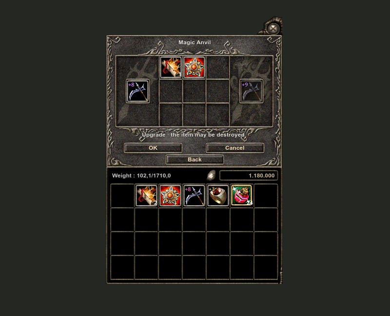
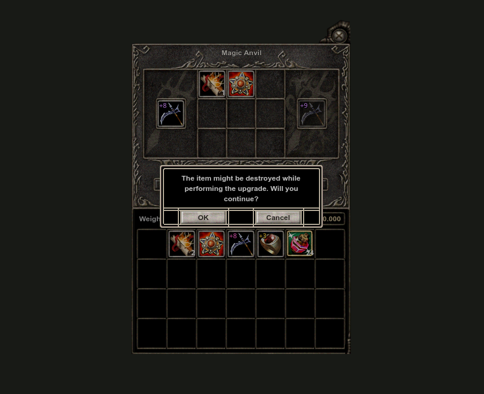
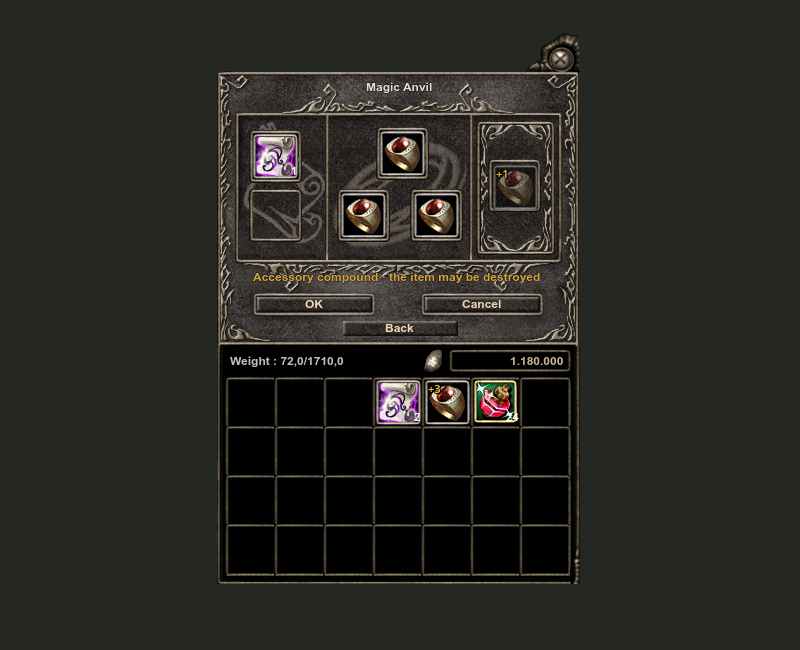
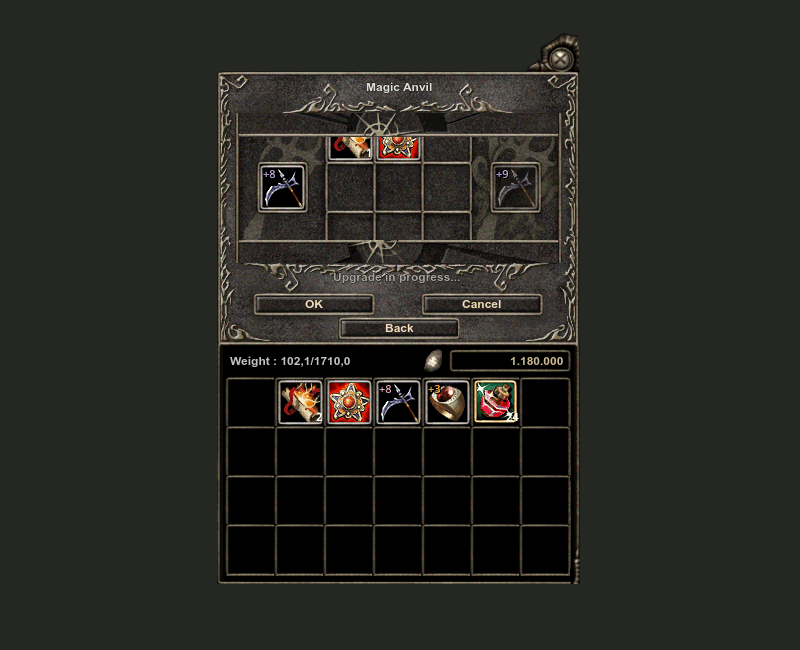
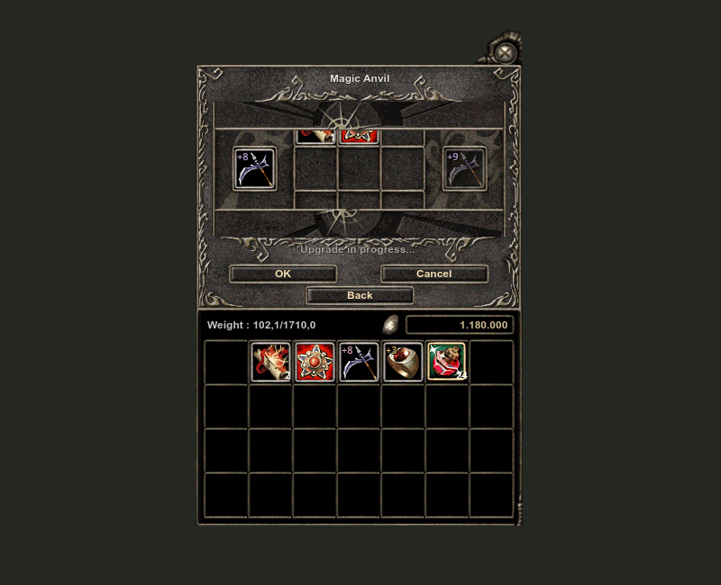

# Anvil material and geometry rework

This review replaces the withdrawn Anvil implementation. The rejected commits were removed from main before publishing the reviewed replacement as one complete Anvil commit per repository. Local recovery refs retain the previous history.

## Cause and correction

The previous composition spliced the original Anvil bench into a nation-specific inventory panel. Their background colors, opacity and borders differed. A solid black mask behind the action buttons also interrupted the original stone plate.

Both nations now use the original Anvil bench with the original Karus inventory lower pieces and wallet field. The first rework tiled a small artwork fragment; that fragment contained visible marks and produced repeating bands. The following flat charcoal experiment was also rejected by the user. The current lower section uses the Karus inventory's own artwork, with black slot interiors and the same editable 45-pixel cells, 49-pixel pitch and 51-by-52 artwork frames as Classic inventory. No complete imported UIF screen replaces the editable component layout.

The weight label uses the live character weight and capacity, divided by ten and formatted exactly like inventory, with the same 12-point bold font and a common baseline with coins. The inventory's painted rims have eight-pixel spacing on both sides, below the wallet band and above the footer rim. The lower artwork width matches the bench width, and the footer is cropped at its painted baseline. The window is 23 pixels shorter, removing the black tail below the border. Runtime label bounds and actual slot positions are checked in the render harness. Independent screenshot pixel samples check all four painted rim intervals and confirm that the row below the footer contains only the preview background.

The black action mask was removed. OK, Cancel and Back use their corresponding original button strips at the original artwork rectangles. Upper sockets no longer add a second outline over the baked socket borders. The bottom border uses separate corners and a center line, avoiding the baked Korean Back caption in the full source strip. The title sits inside the title plate. Confirmation button text is dark on the original pale button artwork.

## Behavior and animation

Native inventory interactions remain connected. Enter and keypad Enter approve the open Anvil warning; Escape cancels it and preserves the staged selection. Repeated key events are ignored. Cancel on the bench resets the staged selection; Back returns to the choice menu. Pending requests and result animation prevent editing. Closing while awaiting a result retains the inventory holds. Serialized preview requests reject stale selection snapshots. A client compatibility path releases preview requests when older fork servers return early refusals with the normal response type. The server was not changed or restarted.

Native item dragging now preserves the icon's displayed size, canvas scale and original pressed point, using the same geometry as Classic inventory dragging. The previous implementation used a fixed 40-pixel preview with no grab offset. The render harness compares native and Classic drag preview bounds and verifies the pressed point under the preview cursor position. This checks the production drag geometry; it is not an OS mouse automation test.

Upgrade material sockets now accept only the explicitly recognized scrolls and support materials. The previous identical-origin exception incorrectly allowed a second weapon with the origin's item ID into those sockets. That exception was removed from both right-click auto-placement and drag/drop validation. Regression checks cover a staged Raptor, an identical Raptor dragged from inventory, and right-clicking the duplicate, while retaining valid BUS moves and material swaps.

Placement also checks the complete proposed selection against the fork's recipes and upgrade settings. It rejects multiple scrolls, conflicting protection, accessory/weapon material mixing, unsupported rebirth/normal combinations, incompatible item classes, zero-rate protection combinations, and Logos grade/type restrictions. Scroll and protection may be placed in either order when a valid completion exists. Right-click placement, inventory drag, upper socket movement and swaps all use the same selection validator. Inventory itself remains freely rearrangeable and retains normal item colors.

The client artwork table does not encode the same ItemClass/ItemType as the server seed tables. The placement metadata therefore comes from the server: 95,056 origins with actual class, type, grade, kind and supported recipe scrolls, compressed into a 310 KB embedded snapshot. `Client/scripts/generate_anvil_rules.py` regenerates that snapshot and the settings JSON from the fork's existing seed tables. Regenerate it when those tables change. Runtime server preview and execution remain authoritative, including customized database recipes, current coins and final success probabilities. The server code and running server were not changed.

Inventory items retain their normal colors and can be dragged between embedded inventory cells through the existing server-confirmed inventory move path. Upgrade suitability is checked at the receiving bench socket, rather than tinting unrelated inventory items red. A previously staged material can move between compatible upper sockets; compatible occupied sockets can swap. The harness specifically checks BUS socket 8 to socket 6, a BUS/Trina swap, invalid origin placement, and unrelated potion rejection by the upper bench. Reservations and preview snapshots follow the new socket positions. Returning a staged item to a chosen inventory cell releases its selection and uses the normal inventory move path; a staged stack material moves exactly one unit. Refreshing inventory after a server acknowledgment now refreshes the embedded cells as well. Pending upgrade and result-animation locks remain active.

Original success and failure texture sequences remain active, including closing and reopening the bench. The gallery contains real timed Godot captures and animated GIFs. These are controlled demo responses, not live upgrade rolls. World success/failure effects are unchanged.

## Verification

- ExportRelease client, Release plugin and source-driven Godot preview builds: no warnings or errors.
- Client tests: 934 passed; no failed tests, including 15 added placement-rule regression cases.
- Human and Karus: current capture/check totals are recorded in `anvil-verification.json`, including actual rendered bounds, Enter approval, Escape cancellation, drag geometry, native tooltip, request locks, counts, preview refusal and timed success/failure sequences.
- Ready, empty, compound and confirmation images are pixel-identical between nations.
- Eight Character Report, Quest, Clan and Friend screenshots remain pixel-identical to the pre-Anvil baseline. Their actual control bounds are retained alongside the screenshots.
- Visual review checked the Karus panel join, lower border, inventory frames and counts, wallet, normal potion colors, moved scroll, drag preview, confirmation and both animation outcomes.

Final render and build hashes are recorded in `anvil-verification.json`. The existing client and benchmark installations are updated without restarting the active game or server. An already running client must load the installed build on its next launch.

## Original reference

[OpenKO UIItemUpgrade.cpp](https://github.com/Open-KO/KnightOnline/blob/7d6cf81093e142c928c2ac9510512b2b182178b5/src/Client/WarFare/UIItemUpgrade.cpp) and the existing imported Anvil atlases were used as references. No official-client packages were extracted.

## Reviewed renders

