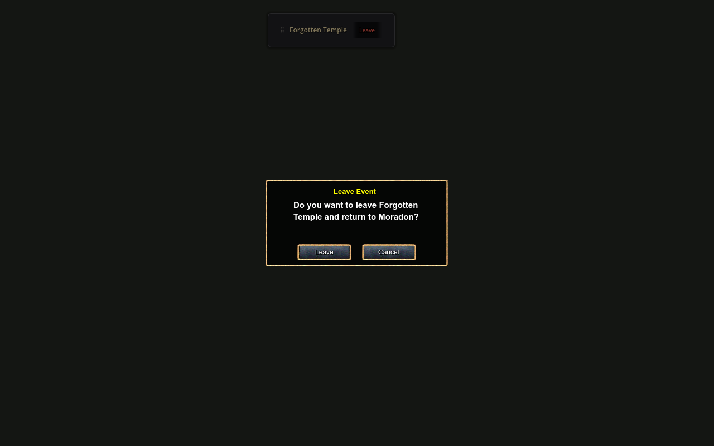
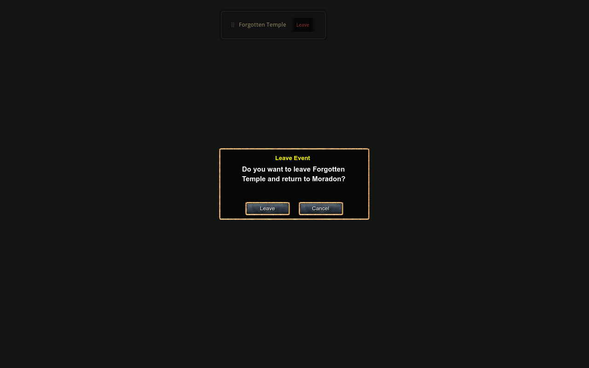

# Forgotten Temple compatibility

Use fork revision [b8b1df1](https://github.com/canbolayir/LibreKO/commit/b8b1df13aa45743a27ecef2f2d6a37ba607bd2d2) with a plugin built against its client assembly. This integration includes upstream Forgotten Temple `ad51723` and UTC follow-up `20dcd08`. The [fork's integration guide](https://github.com/canbolayir/LibreKO/blob/main/docs/forgotten-temple-integration.md) describes the server migration, schedules, rewards and GM commands.

The event uses the existing registration UI and Classic departure confirmation. Repeated Leave clicks keep one prompt; Escape cancels departure and retains the event banner. Changing zones dismisses stale confirmation requests. Existing Classic layouts and inventory, merchant, trade and Anvil behavior are unchanged.





## Verification

The fork passed 3,421 client/server tests. The source-driven harness checks 26 event behaviors per nation, including registration state and departure from all five event zones. Eight Character Report, Quest, Clan and Friend pages, their selection states and their actual rendered bounds match the previous approved review. See the [sanitized verification record](forgotten-temple-verification.json).

Run the reviewed event fixture with a matching client DLL and content pack:

```powershell
dotnet build preview/Preview.csproj -p:LibreKOClientDir="<folder containing LibreKO.dll>"
$env:LIBREKO_AUDIT_CLIENT_PACK = "<client>/LibreKO.pck"
$env:LIBREKO_AUDIT_OUTPUT_DIR = "<review output folder>"
godot --path preview -- forgotten-temple-audit
godot --path preview -- forgotten-temple-audit karus
```

The fixture retains the previously observed Classic-dialog shutdown warning: six exercised confirmations produce six orphan Control allocations (12 ObjectDB instances including wrappers) per nation. The warning is recorded rather than suppressed. No live event combat, reward claims or player transactions were performed. No additional retail extraction or asset bake is required for this event.
