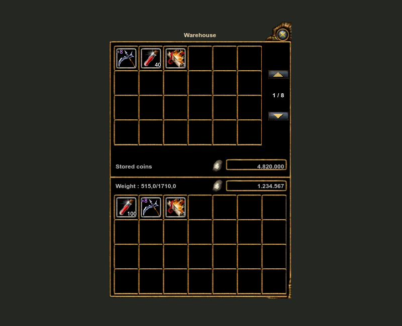
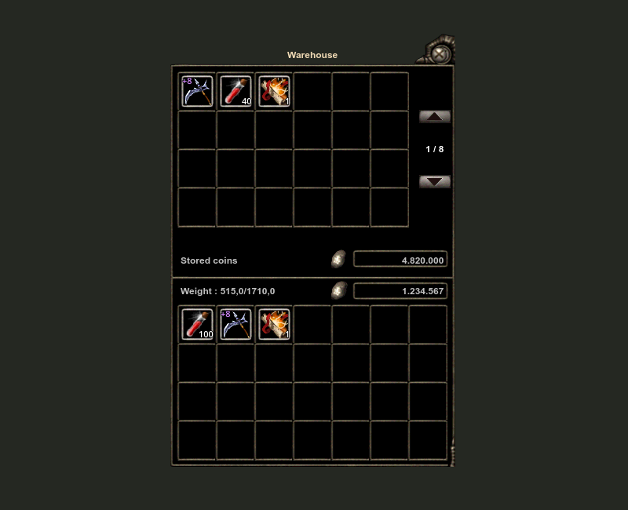
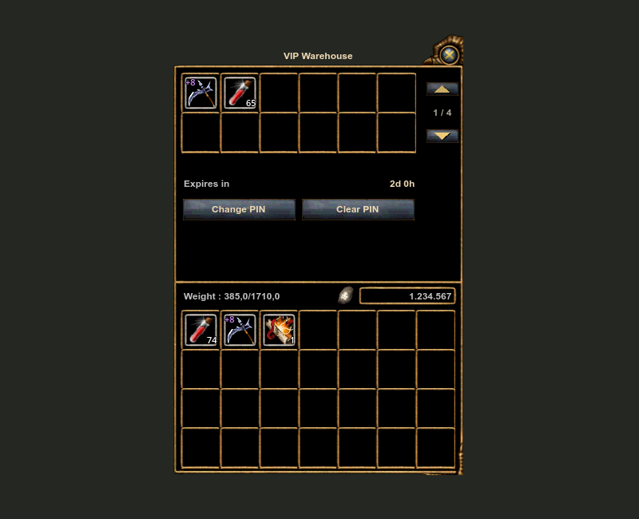
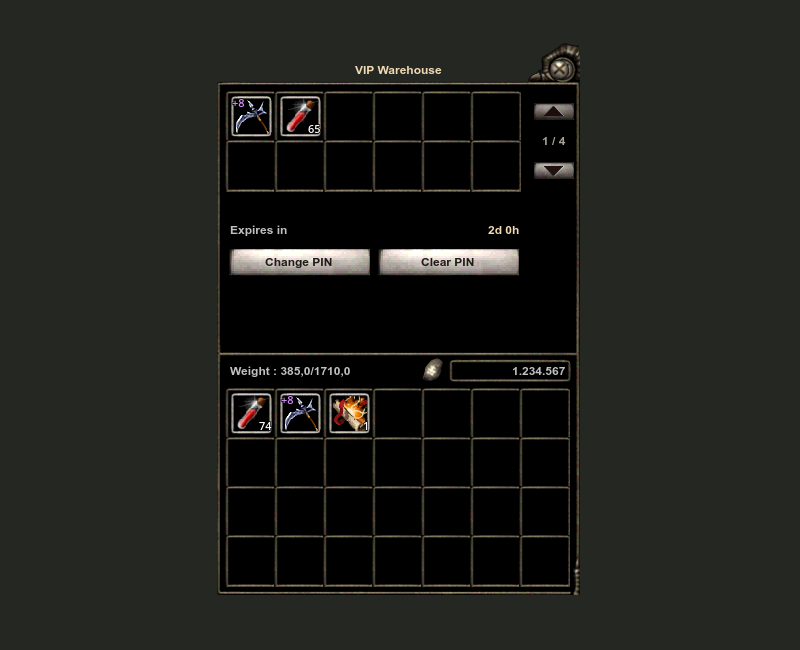
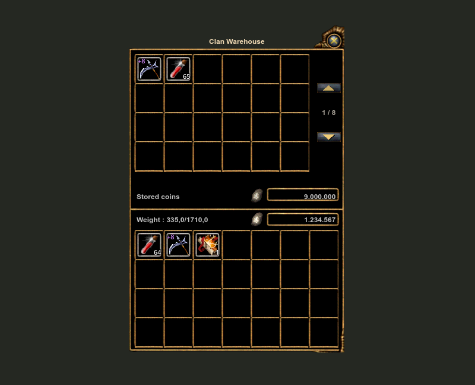
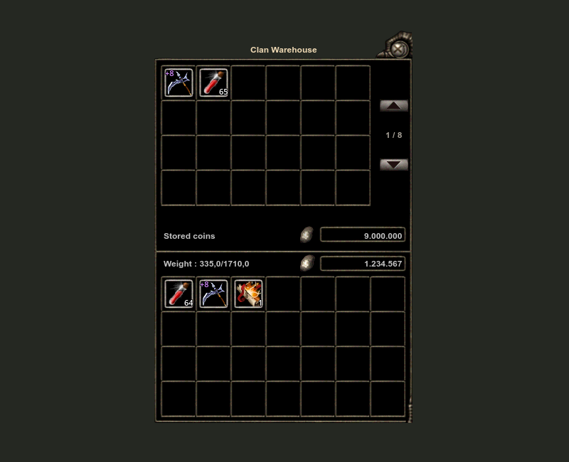
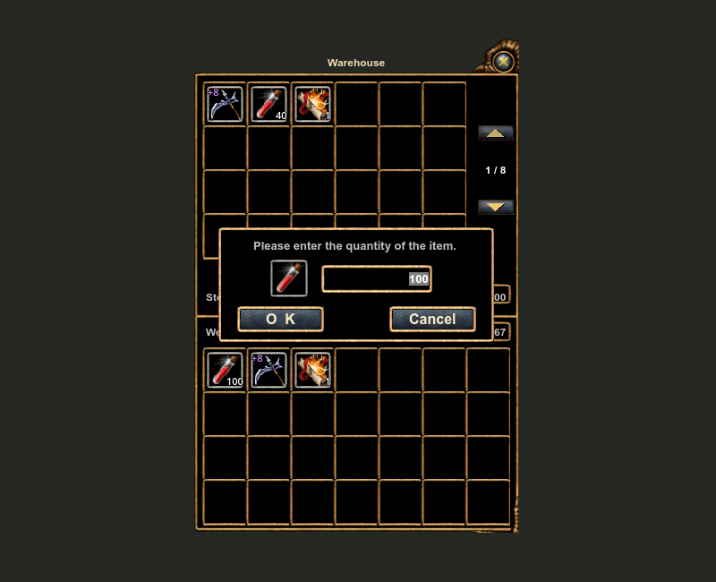
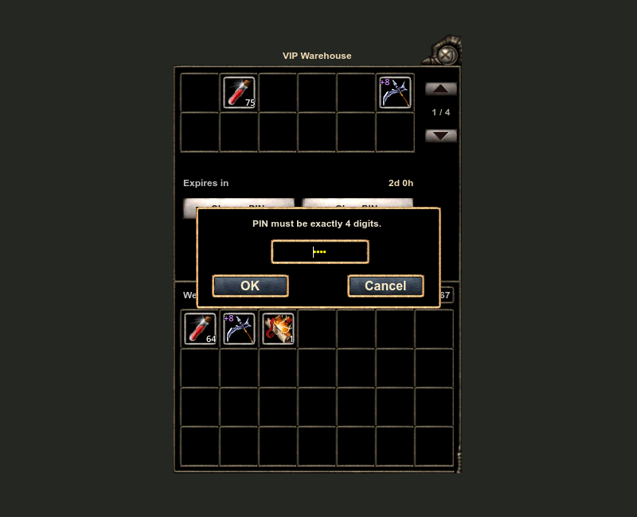

# Classic Warehouse, VIP Warehouse and Clan Warehouse

The editable Classic storage composition uses the existing Human/Karus warehouse artwork and the public [OpenKO warehouse implementation](https://github.com/Open-KO/KnightOnline/blob/7d6cf81093e142c928c2ac9510512b2b182178b5/src/Client/WarFare/UIWareHouseDlg.cpp) as references. It extends live fork controls instead of instantiating complete imported UIF screens or duplicating game state.

Use the matching [canbolayir/LibreKO storage integration](https://github.com/canbolayir/LibreKO/blob/main/docs/storage-integration.md). Unmodified upstream clients do not provide the required storage controls and VIP PIN window.

## Composition

| Screen | Capacity | Visible cells per page | Retained features |
|---|---|---|---|
| Warehouse | 192 across eight pages | 24 storage, 28 inventory | Explicit destinations, stack merging, stored/carried coins |
| VIP Warehouse | 48 across four pages | 12 storage, 28 inventory | Rental expiry, vault keys, secret four-digit PIN, PIN change/clear |
| Clan Warehouse | 192 across eight pages | 24 storage, 28 inventory | Shared items/coins, member deposits, officer withdrawals/rearrangement |

The 366-by-553 composition preserves nation artwork and original close/page/coin controls. `ClassicStorageLayout.cs` defines editable geometry. Stored and carried cells share a left edge; inventory cells have 13/14-pixel side margins. Icons and count labels use the inventory's two-pixel inset. Upgrade badges remain above item icons. Body labels share a bold 12-pixel font; item counts retain the shared 11-pixel outlined style. Page controls are centered on the visible storage grid, including the shorter VIP grid.

Search, static transfer instructions, duplicate capacity text and the clan permission banner are omitted. Weight, balances, page number, VIP expiry and actionable errors remain. Normal storage keeps its timed success/error colors; current VIP/clan errors use amber. Equal-size PIN buttons retain the original nation button artwork.

## Behavior

Right-click stores or withdraws; left drag/drop respects the selected destination. A plain left click does not transfer. Countable stacks above one unit open the original-style quantity frame with the complete count selected. Enter confirms the amount; Escape or Cancel dismisses it. Single countable units transfer directly. Automatic placement merges into an existing compatible stack before using an empty cell.

Native callbacks retain snapshot, capacity, expiry, clan permission and pending-operation checks. Only the matching server acknowledgement changes local contents. Embedded inventory uses the existing move pipeline. Normal storage supports its existing cross-page moves; VIP/clan internal moves are restricted to the current page by the existing packet. VIP/clan item moves and clan coin transfers clear obsolete refusal messages. Coin quantities and secret PIN input reuse the original quantity frame and buttons.

## Rendered examples

| Human | Karus |
|---|---|
|  |  |
|  |  |
|  |  |
|  |  |

## Verification and limits

See [the verification record](storage-verification.json). Client tests: 1,074 passed. Existing server warehouse/vault tests: 14 passed. Source-driven Godot review: 20 states and 5,326 assertions per nation, with no error/shutdown-warning output. All eight existing Human/Karus parent pages, including 20 selection/disabled states and actual bounds, remain pixel-identical to the previous verified build.

The harness invokes live control right-click, left-click, drag/drop and page callbacks; checks quantity Enter/Escape/Cancel, single-unit transfers, partial merging, stale snapshots, wrong acknowledgements, PIN validation, expiry and officer permissions; and measures rendered control bounds, icon/count insets and text sizes. No live player transaction was performed.

Run the dedicated source preview with `storage-audit` (add `karus` for that nation) after building the preview against the matching fork. Set `LIBREKO_AUDIT_OUTPUT_DIR` for retained captures. The complete local gallery is under `research/warehouse-window-audit` in the original workspace. Reviewed assemblies were installed into client and benchmark directories without restarting a user's game. No server source, database, custom Moradon content or official-client extraction is included.
