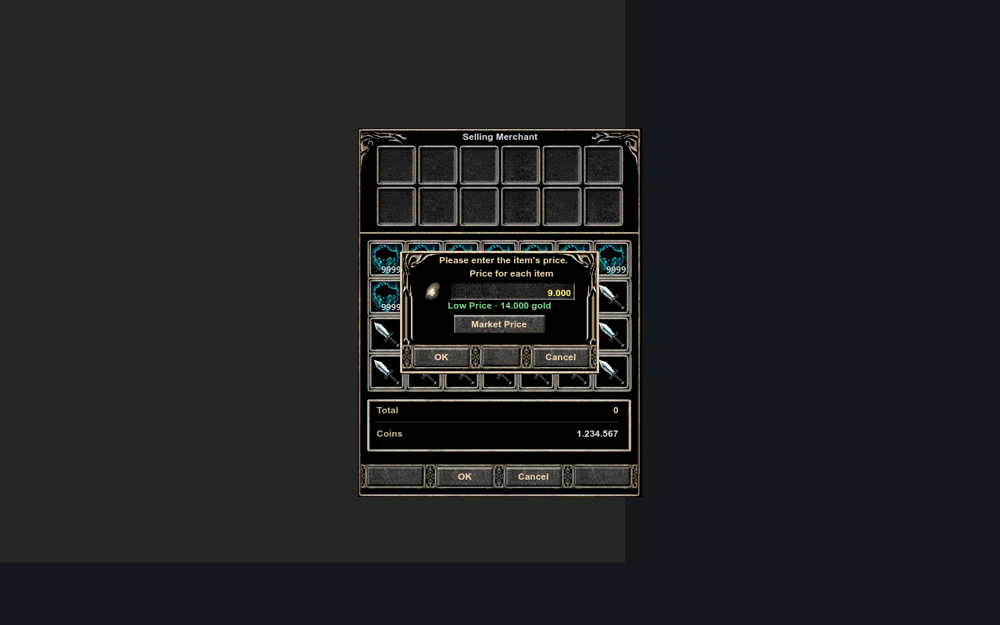
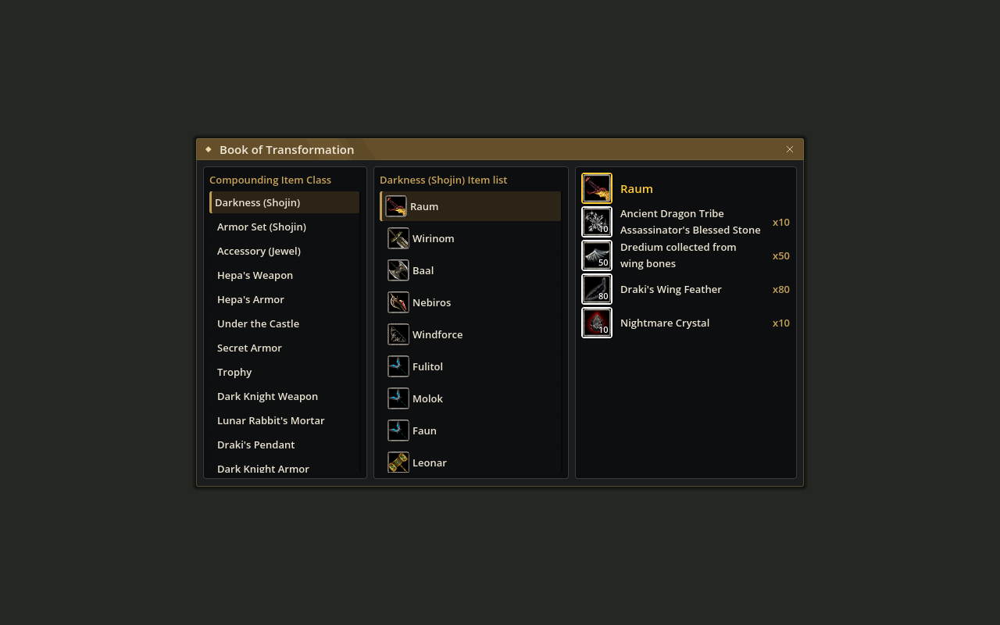
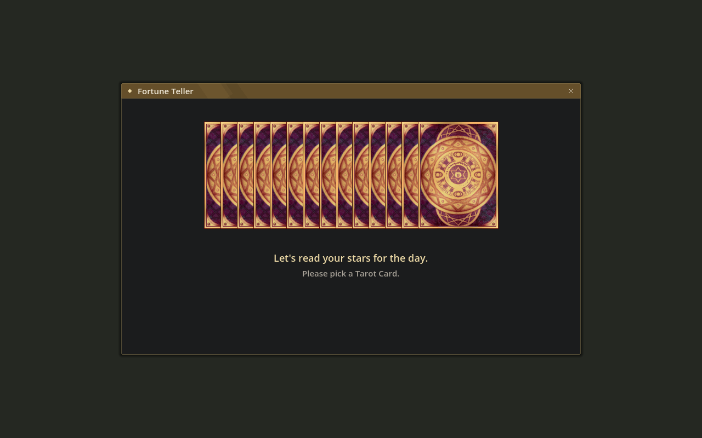
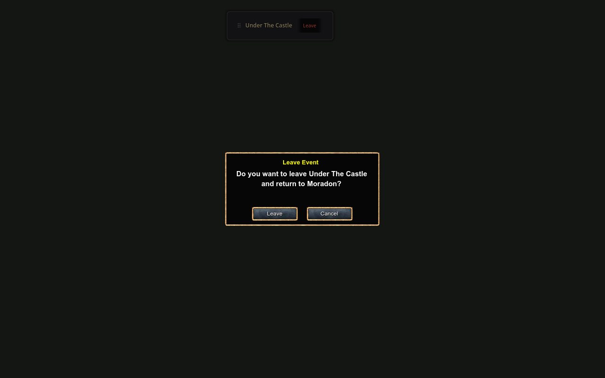

# Market history and new native services

The complete upstream source changes through `28112ee` are integrated into the required [canbolayir/LibreKO fork](https://github.com/canbolayir/LibreKO). They include the `7f21442` NPC-service/market update, `f4c4127` obsolete-window cleanup and Under the Castle/event-departure support. See the fork's [changes, content and deployment guide](https://github.com/canbolayir/LibreKO/blob/main/docs/upstream-npc-events-integration.md).

## Presentation and behavior

Premium listing prices now show the native price comparison and Market Price action inside the original Classic price frame. Only its straight vertical rails extend; original corners, coin field, input and button artwork stay aligned. Quantity, purchase approval and non-premium price windows keep their original geometry. Opening history preserves the pending amount and price. Escape closes history first and then returns to the price stage.

The separate chart and new Akara, Shojin/Jewel recipe book, Mekin, transformation, King/nation and Delos pages keep their upstream native compositions for now. New features are available before their later Classic redesign. They do not replace existing Classic Anvil, inventory, merchant, trade, chat or character-page compositions.

Event departure is routed through the Classic message box. Cancel/Escape retains the event banner, repeated clicks keep one confirmation, and changing zones dismisses an outdated request. Noncombat event and service status messages continue to use Info.

## Compatibility and content

This plugin requires the matching fork client/server, not an unmodified ZeusAFK client. The new NPC protocols and four server migrations require a coordinated deployment. The generated transformation/combination/auction tables and full fortune card/animation folder must be included in the client content pack. Source commits alone do not supply that content. The Assets tools at `e6553f5` provide the required generators; generated official content is not published in this source commit.

Both existing client and benchmark plugin installations are verified using the reviewed DLL and resource pack hashes. An active game is not restarted to capture the review.

## Review

The complete source passed 3,407 domain/protocol tests. Source-driven Human/Karus runs cover 8,459 merchant assertions and 2,290 Anvil assertions per nation, including success/failure sequences. All eight parent Character Report/Quest/Clan/Friend pages retain identical baseline pixels; rendered control bounds and selection/disabled state captures are retained. New service fixtures cover populated generated content, animation completion and departure-dialog behavior.

See [the verification summary](upstream-npc-events-verification.json). These are controlled fixtures, not live two-player transactions, real bids or awarded event items.

The native preview reports two orphan Control instances at shutdown (four ObjectDB instances including wrappers). This diagnostic remains in the verification record; it is not hidden. No assertion, resource-load error or crash occurs in the final run.
